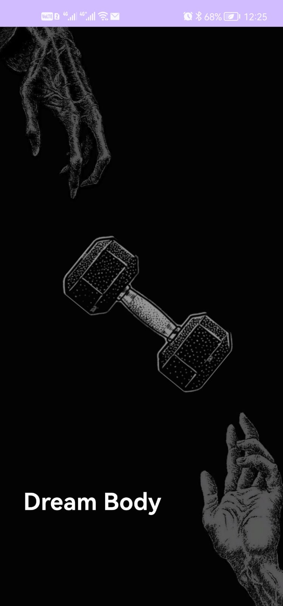
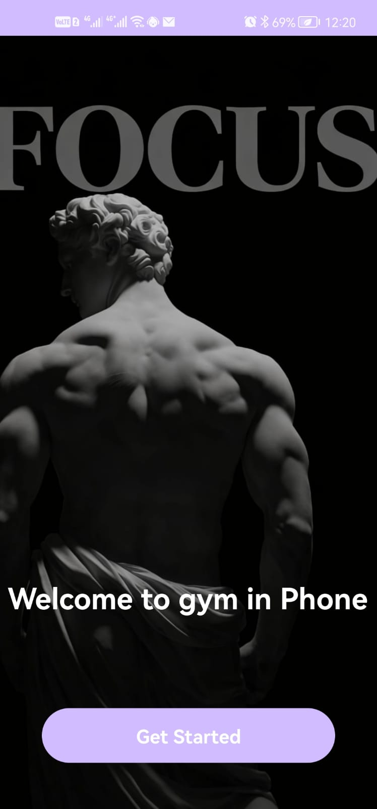
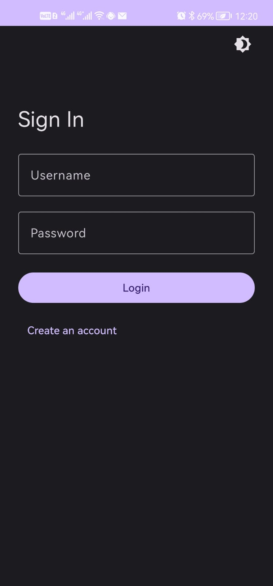
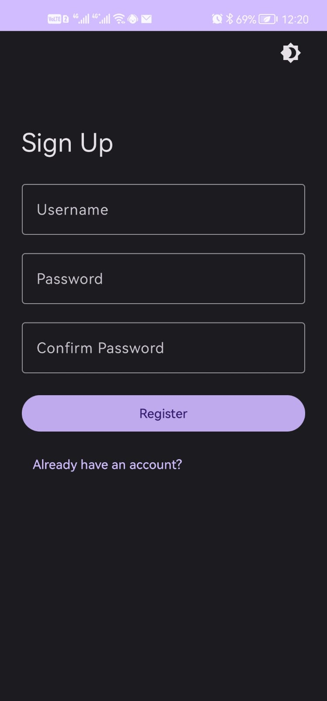
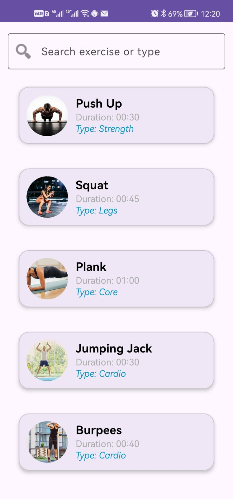
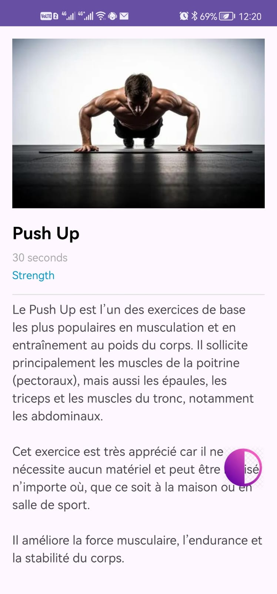

# 🏋️ Body Dream

**Body Dream** est une application **Android de fitness** développée en **Kotlin**.
Elle permet aux utilisateurs de consulter différents exercices physiques et d’obtenir des informations pour améliorer leur condition physique.

---

## 📱 Captures d’écran

Vous pouvez ajouter ici des captures d’écran de l’application.

## 📱 Captures d’écran

### Splash Screen


### Welcome Page


### Sign In


### Sign Up


### Liste des exercices


### Détails de l’exercice


---

## ✨ Fonctionnalités

* 🔐 **Connexion (Sign In)**
* 📝 **Inscription (Sign Up)**
* 🏋️ **Liste des exercices**
* 🔎 **Recherche et filtrage des exercices**
* 📄 **Détails d’un exercice**
* ✏️ **Swipe pour modifier ou supprimer**
* 🌙 **Support du mode sombre (Dark Mode)**

---

## 🧩 Écrans de l’application

### 1️⃣ SignInActivity

Écran de connexion à l’application.

Fonctionnalités :

* Saisie de **l’email**
* Saisie du **mot de passe**
* Bouton **Connexion**
* Animation de transition vers l’écran d’inscription

---

### 2️⃣ SignUpActivity

Écran d’inscription pour les nouveaux utilisateurs.

Fonctionnalités :

* Formulaire d’inscription
* Validation simple des champs
* Animation de retour vers l’écran de connexion

---

### 3️⃣ ListActivity (Exercises)

Cette activité affiche **la liste des exercices** en utilisant **RecyclerView**.

Fonctionnalités :

* Affichage des exercices
* Clic sur un exercice
* Swipe pour **modifier ou supprimer**
* Système de **recherche et filtrage**

---

### 4️⃣ DetailActivity

Cette activité affiche **les détails complets d’un exercice sélectionné**.

Informations affichées :

* Nom de l’exercice
* Durée
* Type d’entraînement
* Conseils liés à l’exercice

---

## 🛠️ Technologies utilisées

* **Kotlin**
* **Android Studio**
* **Jetpack Compose**
* **RecyclerView**
* **Material Design**
* **Dark Mode (Day/Night Theme)**

---

## 📂 Structure du projet

```
BodyDream
│
├── activities
│   ├── SignInActivity
│   ├── SignUpActivity
│   ├── ListActivity
│   └── DetailActivity
│
├── adapter
│   └── ExerciseAdapter
│
├── model
│   └── Exercise.kt
│
└── service
    └── ExerciseService.kt
```

---

## 🚀 Installation

1. Cloner le projet

```bash
git clone https://github.com/yourusername/body-dream.git
```

2. Ouvrir le projet dans **Android Studio**

3. Lancer l’application sur **un émulateur Android** ou **un téléphone**

---

## 👨‍💻 Auteur

**Abderrafia Loulida**
📧 [abdorafia2005@gmail.com](mailto:abdorafia2005@gmail.com)
📱 0620833986


